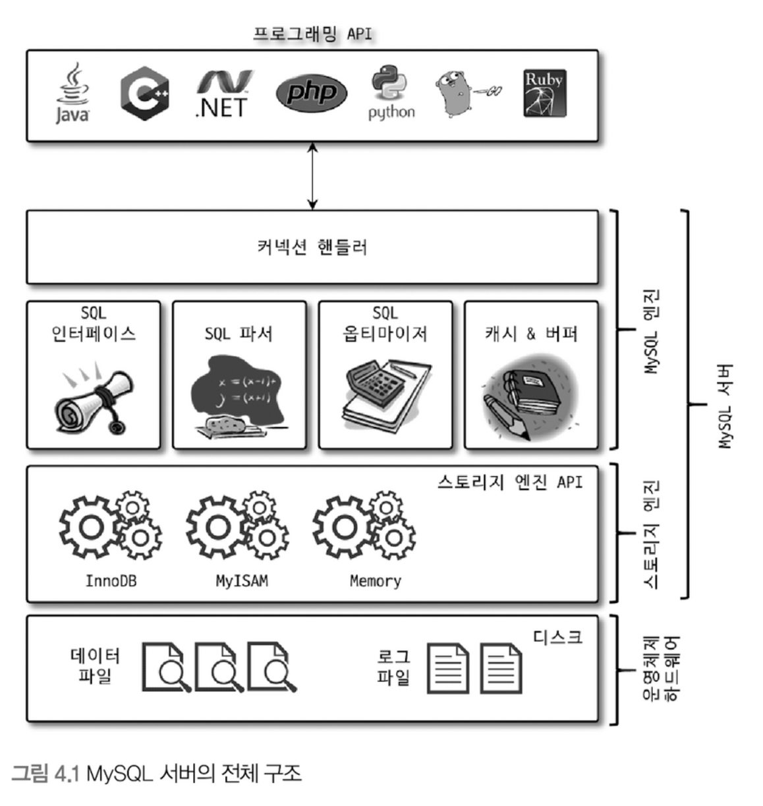
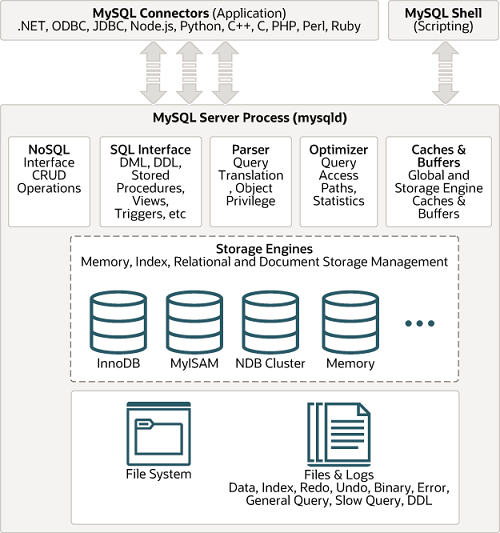
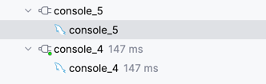
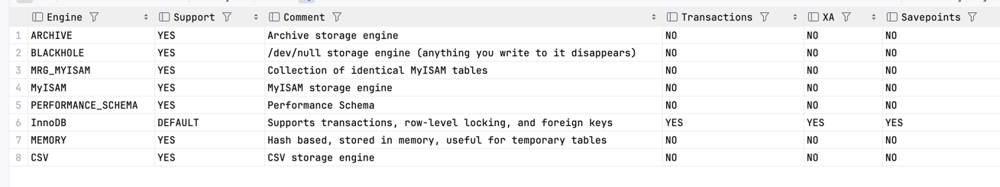
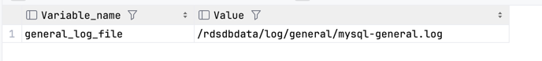

# 4. 아키텍처

## 4.1.1 MySQL 엔진 아키텍처



### 커넥션 핸들러
커넥션 연결과정
1. 클라이언트가 데이터베이스에 TCP/IP 연결을 요청하면 커넥션 핸들러가 이 요청을 받아 처리
2. 사용자 이름 비밀번호 또는 ssl 등 인증, 권한과정을 처리하며 성공하면 사용자 세션을 생성

- 참고
  - datagrip에서 console은 각각의 세션을 의미



## 4.1.2 MySQL 스레딩 구조
- MySQL 서버는 프로세스 기반이 아닌 **스레드 기반**으로 작동
- (종류) 스레드에는 포그라운드(Foreground)와 백그라운드(Background) 스레드로 구분
### 포그라운드 스레드
  - 클라이언트(사용자) 스레드라고도 불림 
  - 클라이언트 스레드는 데이터를 MySQL 데이터 버퍼나 캐시로부터 가져오며, 버퍼나 캐시에 없는 경우 직접 디스크의 데이터나 인덱스 파일로부터 읽어옴
  - 비유를 들자면 클라이언트 스레드는 은행 창구 직원과 같음
### 백그라운 스레드
  - 백그라운 스레드는 서기와 같음
  - (종류)
    - 로그를 디스크로 기록하는 스레드
    - InnoDB 버퍼 풀의 데이터를 디스크에 기록하는 스레드
    - 데이터를 버퍼로 읽어 오는 스레드
    - 잠금이나 데드락을 모니터링 하는 스레드

## 4.1.3 메모리 할당 및 사용 구조
### 글로벌 메모리 영역
- 클라이언트 스레드 수와 무관하게 하나의 메모리 공간만 할당
  - 테이블 캐시
  - InnoDB 버퍼 풀
  - InnoDB 어댑티브 해시 인덱스
  - InnoDB 리두 로그 버퍼

### 로컬 메모리 영역
- 세션 메모리 영역이라고하며 클라이언트가 사용하는 자원
  - 정렬 버퍼(Sort buffer)
  - 조인 버퍼
  - 바이너리 로그 캐시
  - 네트워크 버퍼

## 4.1.4 플러그인 스토리지 엔진 모델
```shell
show ENGINES
```



## 4.1.5 쿼리 실행 구조
- 사용자로부터 TCP/IP 연결을 커넥션 핸들러가 수립
- 사용자의 요청을 클라이언트 스레드가 담당
- 사용자 SQL 요청

### 쿼리 파서
- 쿼리 파서는 사용자 요청으로 들어온 sql을 토큰으로 분리해 트리 형태 구조로 만듦
- 쿼리 문장의 기본 문법 오류는 이때 발견되고 사용자에게 오류 메시지를 전달
```
[42000][1064] You have an error in your SQL syntax; check the manual that corresponds to your MySQL server version for the right syntax to use near '' at line 1
```



### 전처리기

### 옵티마이저
- 사용자의 요청으로 들어온 쿼리 문장을 어떻게 하면 가장 빠르게 처리할지 결정
- 회사의 경영진으로 비전(계획)을 수립

### 실행 엔진
- 회사로 비유하면 중간관리자로 실무자인 핸들러에게 업무를 할당하는 역할을 담당 

### 핸들러
- 실행엔진에 요청에 따라 데이터를 디스크로 저장하고 디스크로부터 읽어 오는 역할
- 결국 스토리지 엔진을 의미하며 InnoDB 스토리지 엔진이 이에 해당

#### 중앙 집중 구조
- 실행엔진과 핸들러를 보며 spring에서 DispatchServlet과 유사한 구조라고 느낌

| 특성 | MySQL 실행 엔진 | DispatcherServlet |
|------|-----------------|-------------------|
| 요청 수신 | SQL 쿼리 | HTTP 요청 |
| 처리 위임 | 스토리지 엔진 (InnoDB, MyISAM 등) | 컨트롤러 |
| 결과 수집 | 스토리지 엔진으로부터 데이터 | 컨트롤러로부터 Model |
| 결과 반환 | 클라이언트에게 쿼리 결과 | 클라이언트에게 렌더링된 뷰 |
| 중앙 제어 | 요청 처리 흐름 관리 | 요청 처리 흐름 관리 |
| 추상화 계층 | 클라이언트와 스토리지 엔진 사이 | 클라이언트와 컨트롤러 사이 |
| 도메인 | 데이터베이스 작업 | 웹 요청 처리 |
| 처리 단위 | SQL 쿼리 | HTTP 요청 |
| 확장성 | 스토리지 엔진 추가 (제한적) | 새 URL 패턴/컨트롤러 추가 (유연함) |


