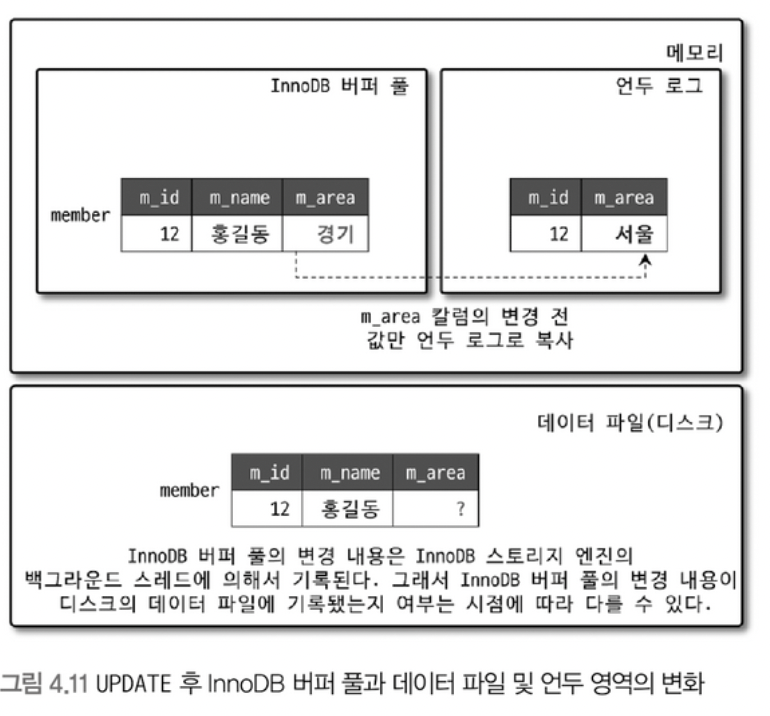

## 1. MySQL 엔진 아키텍처

### 1. MySQL 전체 구조


- **MySQL 서버는 크게 MySQL엔진과 스토리지 엔진으로 구분된다.**
    - MySQL 엔진은 클라와의 접속 및 요청 처리하는 커넥션 핸들러, SQL파서 등의 역할
    - 스토리지 엔진은 DBMS의 두뇌 역할
        - 실제 데이터를 디스크 스토리지에 저장
        - 스토리지로부터 데이터를 읽음
        - 변경작업 같은 것도 다 여기서 처리.
        
- **핸들러(Handler) API**
    - 핸들러(Handler) 요청이란, 스토리지 엔진에 쓰기 또는 읽기를 요청하는 것으로,
        
        이 요청을 위해 사용되는 API를 핸들러 API 라고 한다. ( MySQL 엔진과 데이터를 주고받는다는 뜻 )
        
    - 이 핸들러 API를 통해 얼마나 많은 데이터(레코드) 작업이 있었는지 아래와 같은 명령어로 확인가능하다.
        
        ```python
        SHOW GLOBAL STATUS LIKE 'Handler%';
        ```
        
    - 서버의 상태 변수
        - “Handler_”로 시작하는 상태변수는 “MySQL 엔진이 각 스토리지 엔진에게 보낸 명령의 횟수를 의미하는 변수”라고 이해하면 된다.

### 2. MySQL 스레딩 구조


- MySQL 서버는 프로세스 기반이 아니라 스레드 기반으로 작동하며, 크게는 Foreground와 Background 스레드로 구분할 수 있다.
    
    → 프로세스 기반은 각 클라이언트 요청에 대해 별도의 프로세스를 생성하고, 독립적으로 실행되기 때문에 메모리와 자원을 공유하지 않아 생성비용이 크고, 메모리 사용량이 많으며, 자원간의 상호작용이 비교적 비효율적이다.
    
    → 스레드 기반은 여러 스레드가 하나의 프로세스 내에서 자원을 공유하는 것으로, 클라이언트 연결마다 하나의 스레드를 할당하고 이 스레드가 요청을 처리한다. 스레드 간 자원공유가 쉬워서 메모리와 CPU자원을 더 효율적으로 사용할 수 있고, 동시에 많은 클라이언트 요청을 처리할 수 있다. 
    
    그러나, 스레드 간의 자원을 공유하는 것은 동기화 이슈가 발생할 수 있다. 
    
    - Foreground 스레드
        - 클라이언트 스레드라고도 한다.
        - 클라이언트 사용자가 요청하는 쿼리문당을 처리한다.
        - 클라이언트 사용자가 작업을 마치고 커넥션을 종료하면, 담당하던 스레드는 **스레드 캐시**로 돌아간다.
            - 이미 일정 개수 이상의 대기중인 스레드가 있으면, 캐시에 넣지 않고 종료시켜서 일정 스레드 유지
    - Background 스레드
        - 인서트 버퍼( Insert Buffer )를 병합하는 스레드
        - **로그를 디스크로 기록하는 스레드**
        - InnoDB 버퍼 풀의 데이터를 디스크에 기록하는 스레드
        - **데이터를 버퍼로 읽어오는 스레드**
        - 
        - 잠금이나 데드락을 모니터링하는 스레드
    
    - 사용자의 요청 처리 중 “쓰기”는 지연(버퍼링)이 될 순 있지만, “읽기”는 절대 지연이 있으면 안된다

### 3. 메모리 할당 및 사용구조

- 글로벌 메모리 영역과 로컬메모리 영역을 MySQL 서버 내에 존재하는 많은 스레드가 공유해서 사용하는 공간인지에 대한 여부에 따라 구분된다.

- 글로벌 메모리 영역
    
    → MySQL 서버가 시작되면 운영체제로 부터 할당된다.
    
    → 메모리 공간을 얼마만큼 할당하느 냐는 운영체제의 종류에 따라 다르고, 할당 방식에 따라도 다르다.
    
    → 시스템 변수로 설정해 둔 만큼 운영체제로 부터 메모리를 할당 받는다고 생각해도 된다.
    
    - 테이블 캐시
    - InnoDB 버퍼 풀
    - InnoDB 어댑티브 해시 인덱스
    - InnoDB 리두 로그 버퍼
- 세션(커넥션) 메모리 영역 ( = 로컬 메모리 영역 )
    
    → 클라이언트 스레드가 쿼리를 처리하는 데 사용하는 메모리 영역
    
    → 클라이언트 스레드 별로 **`독립적으로 할당되는 영역이기 때문에 절대 공유되어 사용되지 않는다`**
    
    → 쿼리의 용도별로 필요할 때만 공간이 할당되고 필요하지 않은 경우엔 할당조차 하지 않는다.
    
    → 커넥션이 열려 있는 동안 계속 할당된 상태로 남아있는 공간 ( 커넥션 버퍼, 결과 버퍼 ) or
    
    쿼리를 실행하는 순간에만 할당했다가 해제하는 공간 ( 소트 버퍼, 조인 버퍼 ) 도 있다.
    
    - 정렬 버퍼
    - 조인버퍼
    - 바이너리 로그 캐시
    - 네트워크 버퍼

### 4. 플로그인 스토리지 엔진 모델


- MySQL의 독특한 구조 중 하나는 플러그인 모델
- 쿼리가 실행되는 과정의 대부분은 MySQL 엔진에서 처리되며, 마지막 데이터 읽기/쓰기 작업만 스토리지 엔진에 의해 처리된다.
- 스토리지 엔진을 변경한다고해서 작업 결과물이 바뀌는 것은 아니면, 처리 방법의 차이만 있을 뿐이다.
- GROUP BY 나 ORDER BY같은 복잡한 연산은 쿼리실행기에서 처리됨.
- `SHOW ENGINE` 이라는 명령어로 현재 설치된 서버가 지원하는 스토리지 엔진을 확인 할 수 있다.
    - DEFAULT는 해당 엔진이 플러그인에 없을 경우, 서버가 정상적으로 실행할 수 없다는 것.
    - NO :  현재 서버에 포함되지 않음.
    - DISABLED : 현재서버에는 포함되어 있지만, 파라미터에 의해 비활성화됨.
    
    → 플러그인 형태의 스토리지 엔진을 받아 끼워넣을 수 있고, 얘네를 사용하려면 재컴파일 해야 한다.
    

### 5. 컴포넌트 ( 플러그인 모델 대체하기 위해 나타난 아키텍처 )

- 플러그인 모델의 단점
    - 오직 MySQL 서버와 인터페이스 할 수 있고, 플러그인끼리는 통신할 수 없다.
    - 플러그인은 MySQL 서버의 변수나 함수를 직접 호출하기 때문에 안전하지 않다. ( 캡슐화 X )
    - 플러그인은 상호 의존관계를 설정할 수 없어서 초기화가 어렵다.
- MySQL 8.0 부터 비밀번호 검증 기능이 플러그인에서 컴포넌트로 개선됐다.
    
    ```python
    // validate_password 컴포넌트 설치
    INSTALL COMPONENT "file://component_validate_password";
    // 설치된 컴포넌트 확인
    SELECT * FROM mysql.component
    ```
    

### 6. 쿼리 실행구조

1. 쿼리파서
    - 사용자의 요청으로 들어온 쿼리를 토큰으로 분리해 트리형태의 구조로 만들어내는 작업
        
        → 기본문법 오류는 이 과정에서 발견되고 사용자에게 오류 메세지를 전달하게 된다.
        
2. 전처리기
    - 파서 과정에서 만들어진 트리 기반 문장에 구조적인 문제점을 확인한다.
    - 테이블 명, 칼럼명 , 내장함수와 같은 개체를 매칭해 해당 객체의 존재여부와 객체의 접근권한 등을 이 단계에서 수행한다.
3. 옵티마이저
    - **DBMS의 두뇌 역할**  → 쿼리 문장을 가장 빠르게 처리하는 방법을 의사결정한다.
4. 실행엔진
    - DBMS의 손 역할
    - 만들어진 계획대로 각 핸들러에게 받은 결과를 또 다른 핸들러 요청의 입력으로 연결하는 역할을 수행
    - 예시 ) GROUP BY 를 옵티마이저가 처리하기 위해 임시테이블을 사용하기 결정했다면,
        1. 실행엔진이 핸들러에게 임시테이블을 만들라고 요청
        2. 다시 실행엔진은 WHERE 절에 일치하는 레코드를 읽어오라고 핸들러에게 요청
        3. 읽어온 레코드들을 1번에서 준비한 임시 테이블로 저장하라고 다시 핸들러에게 요청
        4. 데이터가 준비된 임시테이블에서 필요한 방식으로 데이터를 읽어오라고 핸들러에게 다시 요청
        5. 최종적으로 실행엔진은 결과를 사용자나 다른 모듈로 넘김
5. 핸들러 ( 스토리지 엔진 )
    - 실행엔진에 요청에 따라 데이터를 디스크에 저장하고, 디스크로부터 읽어오는 역할을 담당.
6. 쿼리캐시
    - 쿼리 캐시는 SQL의 실행결과를 메모리에 캐시하고,
        
        동일 SQL 쿼리가 실행되면 테이블을 읽지 않고 즉시 결과를 반환하기 때문에 빠른 성능을 보인다.
        
    - 테이블의 데이터가 변경되면 캐시 삭제해야 하는데, 이때 심각한 동시처리 성능 저하를 유발 → 그래서 8.0 버전부터는 없어졌다.
7. 스레드 풀
    - 엔터프라이즈 에디션에만 있는 기능
    - 내부적으로 사용자의 요청을 처리하는 스레드 개수를 줄여서 동시처리되는 요청이 많더라도 MySQL 서버의 CPU가 제한된 개수의 스레드 처리에만 집중할 수 있게 해서 서버의 자원 소모를 줄이는 것을 목적으로 한다.
    - MySQL 서버가 처리해야할 요청이 생기면, 스레드 풀로 이관하게 되고 이 때 스레드 풀이 처리중인 작업이 있으면 thread_pool_oversubscribe 추가로 받아들여 처리할 수 있다.
        
        이 값이 너무 크면 오히려 비효율적으로 작동할 수 있다. ( 기본값 3 )
        
    - 모든 스레드가 작업중이면, work thread를 추가할지 기존 작업 스레드가 처리를 완료할 때까지 기다릴지에 대한 여부를 판단해야 한다.
8. 트랜잭션 지원 메타데이터
    - 데이터베이스 서버에서 테이블의 구조 정보와 Stored Program 등의 정보를 데이터 딕셔너리/메타데이터라고 함.
    - 물론 InnoDB를 사용한다고 해도, 다른 스토리지 엔진의 메타 정보는 다른데다 저장해야 한다.
    - MySQL 서버는 InnoDB 엔진 이외의 스토리지 엔진을 사용하는 테이블을 위해 SDI (Serialized Dictionary Information) 파일을 사용하는데, 이는 기존의 FRM 파일과 동일한 역할을 한다.


## 2. InnoDB 스토리지 엔진 아키텍처

- MySQL의 엔진 중 가장 많이 사용하는 스토리지
- 레코드 기반의 잠금을 제공하며, 높은 동시성 처리가 가능하고 안정적이고 성능이 뛰어남.

### 1. 프라이머리 키에 의한 클러스터링

- InnoDB의 모든 테이블은 프라이머리 키를 기준으로 ( 키 값 순서대로 ) 디스크에 저장된다.
- 모든 세컨더리 인덱스는 레코드의 주소 대신 프라이머리 키의 값을 논리적인 주소로 사용한다.
    
    ⇒ **세컨더리 인덱스가 데이터의 물리적 위치를 직접 가리키지 않고, 그 레코드의 프라이머리 키를 통해 간접적으로 데이터를 참조한다**는 의미
    


### 2. 외래 키 지원

- 외래 키에 대한 지원은 스토리지 엔진 레벨에서 진행된다.
    - MyISAM에서는 프라이머리키 인덱스와 세컨더리 인덱스의 차이를 두지 않는다.
    - 다만 InnoDB 기준, 외래 키는 부모 및 자식 테이블 모두 해당 칼럼에 인덱스 생성이 필요하고, 변경 과정에서 양쪽을 모두 확인하는 과정을 거치기 때문에 여러 테이블에 Lock이 전파될 위험이 있음.

### 3. MVCC  ( Multi-Version Concurrent Control )

- 레코드 레벨의 트랜잭션을 지원하는 기능
    
    **`👇🏻 업데이트 쿼리 실행 시 MVCC 기능 도식화`**
    
    
    
- 다만, 디스크의 데이터 파일에는 새로운 값으로 업데이트가 될 수도 있고… 아닐 수도 있고…
- 이 상황에서, (즉 COMMIT/ROLLBACK 이 되지 않은 상태) 다른 사용자가 조회를 하려고 한다면…
    - 결과적으로는 Isolation Level 에 따라 다름
    - READ_UNCOMMITED 라면 InnoDB의 버퍼 풀이 갖고 있는 데이터를 반환한다.
    - 이외의 경우엔 Undo 영역에 있는 값을 반환한다.
- 현재는 데이터가 1개지만, 트랜잭션이 길어지면 Undo 영역이 갖고 있는 데이터가 점점 길어지게 된다.
    - 용량 문제가 발생할 수도!
- 참고로, COMMIT 이 된다고 Undo 영역의 데이터가 바로 삭제되는것은 아니고, 해당 영역이 필요한 트랜잭션이 더 없을 때 삭제된다.

### 4. 잠금없는 일관된 읽기 ( Non-Locking Consistent Read )

- MVCC 기술을 이용해 잠금을 걸지않고 일기 작업을 수행한다.
    
    → 그렇기 때문에 다른 트랜잭션이 가지고 있는 잠금을 기다리지 않고 읽기 작업이 가능하다.
    
- InnoDB에서 변경되기 전의 데이터를 읽기 위해 언두로그를 사용하게 된다.
- 오랜 시간동안 활성상태인 트랜잭션으로 인해 서버가 느려지는 거는 일관된 읽기를 위해 언두로그에 데이터가 계속 쌓여져 있어서 발생하는 것이다.
    
    → 그래서 트랜잭션이 시작되면 ASAP 롤백이나 커밋을 통해 트랜잭션 완료하는 것이 필요한 거다.
    

### 5. 자동 데드락 감지

- InnoDB 스토리지 엔진은 내부적으로 잠금이 교착상태에 빠지지 않았는지 체크하기 위해서 잠금대기 목록으르 그래프 형태로 관리한다. ( Wait-for List )
    
    → 교착상태에 있는 트랜잭션들은 강제로 종료한다.
    
    → 이 강종의 기준이 되는 것은 **언두로그의 양,** 
    
    → 언두로그가 더 적은 트랜잭션이 일반적으로 롤백의 대상이 된다. ( 언두 처리해도 롤백할 내용이 상대적으로 적어서 서버의 부하를 덜 일으키기 때문 )
    

### 6. 자동화된 장애 복구

- InnoDB는 서버가 시작될 때 항상 자동 복구를 수행하고, 이 단계에서 손상이 있는 경우 서버를 종료해 버린다. → innodb_force_recovery 설정값을 1 부터 6까지 변경해 가면서 재시작을 해보는데, 이 설정값이 커질 수록 복구가능성이 적다라는 뜻이다.
- MySQL 서버가 기동되고 InnoDB테이블이 인식된다면, mysqldump를 이용해 가능한 만큼 백업을 해놓고 그 데이터로 서버의 DB와 테이블을 다시 생성하는 것이 좋다.

### 7. InnoDB 버퍼 풀

1. **버퍼풀의 크기 설정**
    - InnoDB 스토리지 엔진의 가장 핵심적인 부분으로, 디스크의 데이터 파일이나 인덱스 정보를 메모리에 캐시해 두는 곳이다.
    - 데이터를 변경하는 쿼리는 데이터 파일의 이곳저곳에 위차한 레코드를 변경하기 때문에 랜덤한 디스크 작업을 발생시킨다.
        
        → 하지만, 버퍼풀이 이러한 변경된 데이터를 모아서 일괄처리 함으로서 디스크의 작업횟수를 줄여준다.
        
    - 레코드 버퍼란?
        - 클라이언트 세션에서 레코드를 읽고 쓸 때, 버퍼로 사용하는 공간.
        - 커넥션이 많고, 사용하는 테이블이 밚을 경우 레코드 버퍼용도로 사용되는 메모리가 꽤 차지하게 된다.
            
            → 상황에 따라 InnoDB의 버퍼 풀 크기를 조정해야 한다.
            
            → 버퍼 풀 크기 변경은 크리티컬한 변경이므로 서버가 한가한 시간에 조정해야 한다.
            
            → 버퍼 풀의 크기를 줄이거나 느릴 때는 반드시 MySQL 매뉴얼의 내용을 숙지하고 진행해야 한다.
            
2. **버퍼풀의 구조**
    - 페이징 구조를 가지고 있다.
    - LRU 리스트, Flush 리스트, Free 리스트라는 3개의 자료구조로 관리한다.
        - 아래의 그림과 같은 LRU리스트 구조의 핵심은 디스크로부터 한 번 읽어온 페이지를 최대한 오랫동안 InnoDB 버퍼풀의 메모리에 유지해서 디스크 읽기를 최소화 시키는 거다.
    
    - 데이터를 찾는 과정 ( LRU )
        1. 필요한 레코드가 저장된 데이터 페이지가 버퍼풀에 있는지 검사한다.
            - InnoDB 어댑티브 해시 인덱스를 이용해 페이지 검색
            - 해당테이블의 인덱스 (B-Tree)를 이용해 버퍼 풀에서 페이지를 검색
            - 버퍼 풀에 이미 데이터 페이지가 있었다면 해당 페이지의 포인터를 MRU 방향으로 승급
        2. 디스크에 필요한 데이터 페이지를 버퍼 풀에 적재하고, 적재된 페이지에 대한 포인터를 LRU 헤더 부분에 추가
        3. 버퍼 풀의 LRU 헤더 부분에 적재된 데이터가 실제로 읽히면 MRU 헤더 부분으로 이동한다.
        4. 버퍼 풀에 상주하는 데이터 페이지는 사용자 쿼리가 얼마나 최근에 접근했었는지에 따라 나이가 부여되고, 버퍼 풀에 상주하는 동안 쿼리에서 오랫동안 사용되지 않으면 데이터 페이지에 부여된 나이가 오래되어 제거된다. 
        5. 버퍼 풀의 데이터 페이지가 쿼리에 의해 사용되면 나이가 초기화 되어 다시 MRU의 헤어 부분으로 옮겨진다.
        6. 필요한 데이터가 자주 접근됐다면, 해당페이지의 인덱스 키를 어댑티브 해시 인덱스에 추가
            
            ⇒ 그러면 이 데이터 페이지는 버퍼풀 MRU영역에서 살아남게 된다.
            
    - Flush
        - 디스크로 동기화 되지 않은 데이터 페이지의 변경시점 기준의 페이지 목록을 관리한다.
        - 데이터가 변경되면 InnoDB는 변경 내용을 리두 로그에 기록하고 버퍼 풀의 데이터 페이지에도 변경 내용을 반영한다.
        - 체크포인트를 발동시켜, 디스크의 리두 로그와 데이터 페이지의 상태를 동기화 시킨다.
            
            → `MySQL서버가 시작 될 때, 리두로그의 어느 부분부터 복구를 실행해야 할지 판단하는 기준점이 된다.`
            
    
    1. **버퍼풀과 리두로그**
    - 버퍼풀은 서버메모리가 허용하는 만큼 크게 설정하면 할 수록 쿼리성능이 좋아진다.
    - InnoDB의 버퍼풀은 DB 서버의 성능향상을 위해 `데이터 캐시`와 `쓰기 버퍼링`이라는 것이 있는데,
        
        이 두 마리 토끼를 잡기 위해 리두 로그와 버퍼풀의 관계를 이해할 수 있어야 한다.

        
    - 리두로그
        - 트랜잭션이 성공적으로 커밋했을 때의 변경사항을 영구적으로 저장하기 위한 로그 파일이다.
    - 버퍼풀과 리두로그의 관계
        - 트랜잭션으로 데이터를 변경할 때, 실제 데스크에 있는 데이터를 직접 수정하는 대신, 먼저 버퍼풀에 로드된 페이지에서 변경사항을 적용한다. ( dirty page ) 즉, 아직 디스크에는 변경사항이 기록되지 않는다.
        - 수정사항이 버퍼풀에서 발생하면, 해당 변경 내용을 리두 로그에 기록한다.
            
            이 때, 리두 로그는 순차적으로 기록하기 때문에 트랜잭션이 커밋된 후에도 장애발생 시 로그를 기반으로 복수할 수 있다.
            
        - 주기적으로 체크포인트 ( 더티페이지와 디스크 동기화 ) 이벤트를 발생할 때, 리두로그에 기록된 변경사항을 기반으로 데이터를 안전하게 디스크에 옮긴다.
        
        ⇒ 이를 통해 데이터베이스는 높은 성능과 데이터 무결성을 동시에 유지할 수 있게 된다.
        

1. **버퍼풀 플러시**
    - 버퍼 풀에서 아직 디스크로 기록되지 않은 더티 페이지들을 성능상의 악영향 없이 디스크에 동기화하기 위해 다음과 같이 2개의 플러시 기능을 백그라운드로 실행한다.
        - Flush_list Flush
            - 플러시 리스트에서 오래전에 변경된 데이터 페이지 순서대로 디스크에 동기화
            - 얼마나 많은 더티페이지를 한 번에 기록하냐가 성능에 영향을 미칠 수 있다.
                
                → 더티페이지 수가 많아지면 Disk I/O Burst가 발생할 수 있다.
                
                → 설정을 변경하여 일정 수준 이상의 더티 페이지가 발생하면 조금씩 기록하도록 한다.
                
            - Adaptive Flush 기능을 사용하면, InnoDB는 Redo 로그의 증가 속도를 분석하여 적절한 수준의 더티페이지가 버퍼 풀에 유지될 수 있도록 디스크 쓰기를 실행한다.
        - LRU_list Flush
            - LRU 리스트에서 사용 빈도가 낮은 데이터 페이지들을 제거해서 새로운 페이지들을 읽어올 공간을 만들어야 한다.
            - LRU 리스트를 스캔하면서 더티페이지는 동기화하고, 클린페이지는 Free 리스트로 페이지를 옮김.
            
2. **버퍼 풀 상태 백업 및 복구**
    - 버퍼풀에 쿼리들이 사용할 데이터가 이미 준비돼 있으면 디스크에서 데이터를 읽지않아도 쿼리하 처리될 수 있기 때문에 InnoDB 서버에서 버퍼풀은 쿼리 성능에 매우 밀접한 관계가 있다.
3. **버퍼 풀의 적재내용 확인**
    - innoDB_buffer_page 테이블을 이용해 버퍼 품의 메모리에 어던 테이블의 페이지들이 적재돼 있는 지 확인할 수 있다.
    - 버퍼풀이 커지면, 조회쿼리 성능이 떨어지는 것을 방지하기 위해 MySQL 8.0 버전에선 information_schema 데이터베이스에 innodb_cached_indexes 테이블이 새로 추가됐다.
        
        ⇒ 테이블의 인덱스 별로 데이터 페이지가 얼마나 버퍼 풀에 적재되어 있는지 확이할 수 있다.
        

### 8. Double Write Buffer

- InnoDB에서 리두로그는 공간의 낭비를 막기위해 페이지의 변경된 내용만 기록한다.
    
    → 더티페이지를 디스크로 플러싱할 때, 일부만 기록되는 문제가 발생할 경우 페이지의 내용을 복구할 수 없을 수도 있다. ( = Partila page / = Torn page )

- DoubleWrite 버퍼 공간에 기록된 내용은 실제 데이터 파일의 쓰기가 실패할 때만 사용된다.
    - InnoDB는 재시작 될 때 DoubleWrite 버퍼의 내용과 데이터 파일의 페이지들을 모두 비교하여 다른 내용을 담고 있는 페이지가 있다면 DoubleWrite 버퍼의 내용을 데이터 파일의 페이지로 복사한다.
    

### 9. 언두 로그

- InnoDB 스토리지 엔진은 트랜잭션과 격리수준을 보장하기 위해 DML ( INSERT, UPDATE, DELETE )로 변경되기 이전 버전의 데이터를 별도로 백업한다. 이렇게 백업한 데이터를 언두로그(Undo Log )라고 한다.
    - **트랜잭션 보장**
        
        트랜잭션이 롤백되면, 트랜잭션 도중에 변경된 데이터를 변경 전 데이터로 복구해야 하는데 이때 언두로그에 백업해 둔 이전 데이터를 이용한다.
        
    - **격리 수준 보장**
        
        특정 커넥션에서 데이터를 변경하는 도중에 다른 커넥션에서 데이터를 조회하면, 트랜잭션 격리수준에 맞게 변경중인 레코드를 읽지않고 언두로그에 백업해둔 데이터를 읽어 반환한다.
        
1. **언두 로그 레코드 모니터링**
    - 활성 상태의 트랜잭션이 장시간 유지가 될 경우, 언두 로그가 많이 쌓이게 되고 그만큼 성능저하를 불러올 수 있다.
        
        → 따라서 언두로그의 급증 여부를 모니터링하는 것이 늘 필요하다.
        

1. 언두 테이블스페이스 관리
    - 언두로그가 저장되는 공간을 “언두 테이블스페이스”라고 한다.

- 언두 테이블스페이스는 1~128개의 롤백 세그먼트를 가지며, 각각의 롤백 세그먼트는 1개 이상의 Undo Slot을 가진다.
- 하나의 트랜잭션은 실행하는 INSERT, UPDATE, DELETE 문장의 특성에 따라 최대 4개까지 Undo Slot 을 사용한다.
- 공간이 남는건 문제가 되지 않지만, 슬롯이 부족한 경우에는 트랜잭션을 시작하지 못 할수도 있다.

### 10. 체인지 버퍼

RDBMS에서 레코드가 Insert되거나 update 될때는 데이터 파일이 변경되는 작업뿐만 아니라, 

해당 테이블에 포함된 **`인덱스를 업데이트`** 하는 작업도 같이 필요로 한다.

- 인덱스가 많으면, 그만큼 인덱스 업데이트에 자원소모가 커진다.
- 그래서 인덱스 페이지가 버퍼 풀에 있으면, 바로 업데이트 수행하고
- 그렇지 않으면 임시공간에 저장했다가 바로 사용자에게 결과를 반환하는 형태로 성능을 향상시킨다.
    
    → 이 때의 임시공간을 체인지 버퍼 (Change Buffer) 라고 한다.
    
- 사용자에게 결과를 전달하기 전에 반드시 중복여부를 체크해야하는 유니크 인덱스는 사용할 체인지 버퍼를 사용할 수 없다.
- 체인지 버퍼에 임시로 저장된 인덱스 레코드 조각은 백그라운드 스레드에 의해 병합된다.

### 11. 리두로그 및 로그 버퍼
    
- 리두로그는 트랜잭션의 4가지 요소인 ACID 중에서 D (Durable)에 해당하는 영속성과 가장 밀접하게 연관되어 있다.
    
    ⇒ 즉, 서버가 비정상적으로 종료되어도 데이터 파일에 기록되지 못한 데이터를 잃지 않게 해주는 안전장치이다.
    
- 커밋됐지만, 데이터 파일에 기록되지 않은 데이터
    
    ⇒ 리두로그에 저장된 데이터를 다시 복사하면 된다.
    
- 롤백됐지만, 데이터 파일에 이미 기록된 데이터
    
    ⇒ 어떤 변경이 커밋 / 롤백 되었는지, 아니면 트랜잭션 실행중인지 확인하는 데 쓰인다.

---
### 총 요약 :  **`언두 vs 리두`**
    
| **특징** | **언두 로그 (Undo Log)** | **리두 로그 (Redo Log)** |
| --- | --- | --- |
| **기능** | 실패한 트랜잭션을 롤백하기 위해 원래 상태로 복구함 | 커밋된 트랜잭션을 복구하여 변경 사항을 재적용함 |
| **언제 사용** | 트랜잭션이 실패하거나 롤백될 때 사용됨 | 시스템 장애 후 커밋된 데이터를 복구할 때 사용됨 |
| **저장하는 내용** | 트랜잭션 실행 전의 데이터 상태 | 커밋된 트랜잭션 이후의 데이터 변경 사항 |
| **대상** | 롤백해야 하는 트랜잭션 | 복구해야 하는 커밋된 트랜잭션 |
| **용도** | 트랜잭션 무결성 보장 | 장애 복구 및 데이터 일관성 보장 |
---

### 12. 어댑티브 해시 인덱스

- InnoDB에서 요청하는 데이터에 대해 자동으로 생성하는 인덱스
    
    → **`데이터 페이지를 메모리( 버퍼풀 ) 내에서 더 빠르게 접근하게 해준다.`**
    
- B-Tree 검색시간을 줄여주기 위해 도입된 기능이다.
    - 자주 읽히는 데이터 페이지의 key값을 이용해서 해시 인덱스를 만든다.
    - 필요할 때마다 어댑티브 해시 인덱스를 검색해서 레코드가 저장된 페이지르 즉시 찾는다.
- “인덱스 키 값” 과 “데이터 페이지 주소”의 쌍으로 관리된다.
    
    ( B-Tree 인덱스의 고유번호 - B-Tree 인덱스 실제 키 값 )
    
    여기서 B-Tree 인덱스의 고유번호가 포함되는 이유는 모든 B-Tree 인덱스에 대한 어댑티브 해시 인덱스가 하나의 해시 인덱스에 저장되며, 특정 키 값이 어느 인덱스에 속한 것인지도 구분해야 하기 때문이다.
    
- 어댑티브 해시 인덱스를 사용하면 좋은 경우
    - 디스크의 데이터가 InnoDB 버퍼 풀 크기와 비슷한 경우 ( 디스크 읽기가 많지 않은 경우 )
    - 동등 조건검색이 많은 경우
    - 쿼리가 데이터 중에서 일부데이터에만 집중되어 있는 경우
- 어댑티브 해시 인덱스를 사용해도 큰 성능효과가 없는 경우
    - 디스크 읽기가 많은 경우
    - 특정 패턴의 쿼리가 많은 경우 ( JOIN, LIKE, .. )
    - 매우 큰 데이터를 가진 테이블의 레코드를 폭넓게 읽는 경우

## 3. MySQL 로그 파일

1. 에러 로그 파일
    - MySQL이 실행되는 도중에 발생하는 레어나 경고 메세지가 출력되는 로그 파일
    - my.cng에서 log_error라는 이름의 파라미터로 정의된 경로에 생성된다.
        - MySQL이 기동되는 과정과 관련된 정보 및 에러 메세지
        - 비정상적인 종료 시 InnoDB의 트랜잭션 복구 메세지
        - 쿼리 처리 도중에 발생하는 문제에 대한 에러 메세지
        - 비정상적으로 종료된 커넥션에 대한 메세지
        - InnoDB의 모니터링 / 상태조회 명령의 결과 메세지
            
            ```python
            SHOW ENGINE INNODB STATUS 
            ```
            
        - MySQL 종료메세지
        
2. 제너럴 쿼리 로그 파일 ( 제너럴 로그 파일, General log )
    - MySQL 접속하는 모든 쿼리와 명령어를 기록하기 때문에, DB에 발생하는 모든 활동을 추적할 수 있다. → 디버깅과 문제분석 시 유용하다.
3. 슬로우 쿼리 로그
    - 특정 시간 이상 걸린 쿼리만 기록한다.
    - 쿼리 성능을 분석하고 최적화 하는데 사용된다.