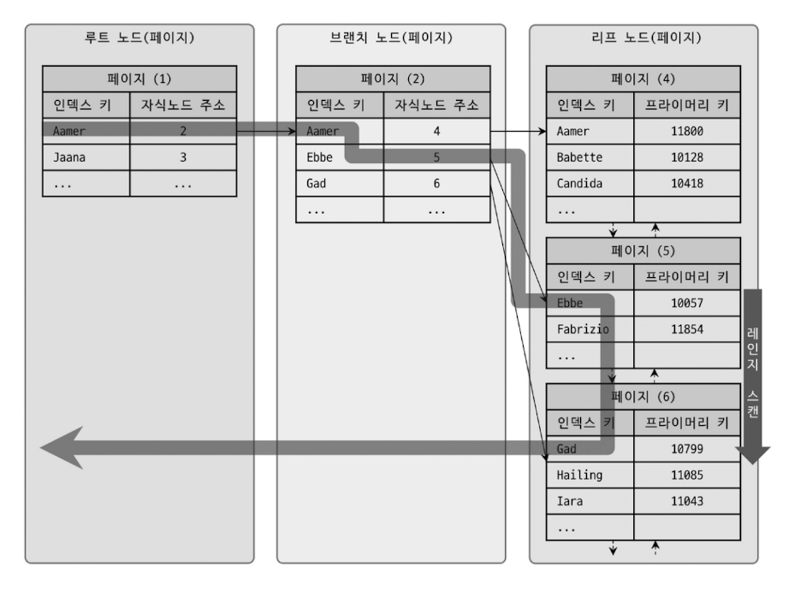
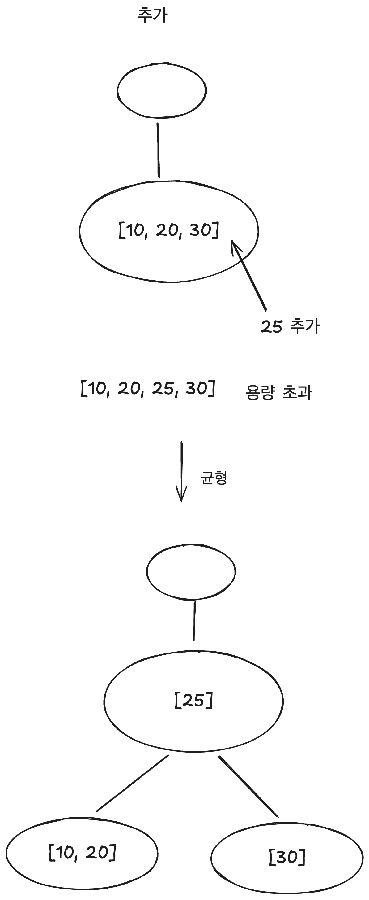
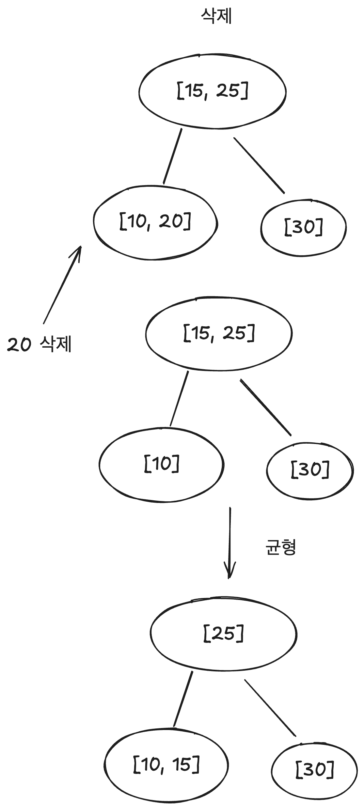

# 8장 인덱스

## 디스크 읽기 방식

### 디스크 I/O
- DB의 성능 튜닝은 대부분 디스크 I/O를 줄이는 방향으로 이루어진다.

### SSD vs HDD

### 랜덤 I/O vs 순차 I/O

## 인덱스
- 인덱스: 항목과 페이지 번호를 매칭시켜주는 역할

### B-Tree 인덱스
- 의의: 검색, 정렬, 데이터 접근 최적화 등의 기능을 제공하여 성능 튜닝의 핵심 역할을 합니다.

#### 특징
- B-Tree는 DB에서 가장 일반적으로 사용되는 인덱스 알고리즘이다.
- 인덱스의 키 값은 모두 정렬되어 있지만, 데이터 파일의 레코드는 정렬되어 있지 않다.
  - B-Tree의 특징은 트리 전체가 정렬된 상태로 유지된다는 것
  - 추가나 삭제 후에는 트리의 균형 유지 작업 중요
    => 만약 데이터가 삽입되어 한쪽으로 치우치거나, 삭제되어 트리가 헐거워지면 성능 감소
- 여러 단점을 감당하며 인덱스를 쓰는 이유는 “빠른 검색” 때문이다.

#### B-Tree 인덱스 사용에 영향을 미치는 요소
1. 인덱스 키 값의 크기
2. B-Tree 깊이
3. 카디널리티
4. 읽어야 하는 레코드의 건수
- 인덱스를 통해 레코드를 읽는 것은 바로 테이블의 레코드를 읽는 것 보다 비용이 높다. (약 4~5배)

#### B-Tree 인덱스를 통한 데이터 읽기
1. 인덱스 레인지 스캔
2. 인덱스 풀 스캔
3. 루스 인덱스 스캔
4. 인덱스 스킵 스캔

#### InnoDB와의 연관
- InnoDB에선 PK만이 물리적인 주소를 가지므로 세컨더리 인덱스를 이용하여 데이터를 찾기 위해선 두번의 B-Tree 탐색이 필요하다.
- "PK만이 물리적인 주소를 갖는다."의 의미
  - InnoDB에서 기본 키가 테이블의 실제 데이터 저장 위치와 직결되어 있다는 의미
  - InnoDB는 기본적으로 클러스터형 인덱스를 사용하여 테이블 저장.
    이는 테이블의 데이터 자체가 기본키(PK)를 기준으로 정렬되고 저장된다는 것. 
    즉, 기본 키 자체가 데이터가 저장된 실제 물리적인 주소입니다.
- 기본 키가 이 트리의 루트부터 각 리프 노드까지의 경로를 결정

InnoDB에서 인덱스를 통해 데이터를 읽는 과정

### 그외

#### R-Tree 인덱스
- 기본적인 내부 매커니즘은 B-Tree와 비슷하나 인덱스를 구성하는 컬럼의 값이 2차원 공간 개념값
- 공간데이터 다룰 때 중요 

ex) 지도 - 좌표, 게임 - 충돌감지, 범위 안
- 각 좌표를 사각형의 범위로 표현하고, 사각형이 서로 겹치는지 확인 => 공간을 나누어 데이터 탐색

#### 전문 검색 인덱스
- 특정 키워드가 포함된 문서를 검색
- DB에 저장된 긴 Text에서 특정단어를 빠르게 찾거나 자연어 검색 시 각 단어에 대한 인덱스를 건다. (Text를 단어 단위로 분할)

ex) 검색엔진, 블로그-포럼 게시물

---

# B-Tree 인덱스

## 특징
- **균형 잡힌 트리 구조** 덕분에 검색, 삽입, 삭제 등에서 효율적인 성능 제공.
- 조회뿐만 아니라 삽입과 삭제가 빈번한 테이블에서도 적절히 관리되면 성능을 보장할 수 있습니다.

### 균형 잡힌 트리구조
1. 트리구조
- 데이터를 여러 층으로 나누어 정리하는 방식

2. 균형잡힌 트리
- 트리 구조에서 모든 경로의 길이가 비슷하게 유지되는 것
  즉, 어떤 데이터를 찾을 때 특정 경로가 일정한 길이로 유지되어 성능이 고르게 나온다.

3. 검색, 삽입, 삭제에서 효율적인 성능이란?
- 왜 효율적인가?: 균형 유지 -> 데이터를 찾거나 추가하고 삭제할 때 모든 데이터에 대해 동일한 시간 복잡도를 유지
- 검색: 트리가 균형 유지하기에 특정 데이터를 찾는 시간이 항상 비슷하고 효율적으로 찾는다. 풀스캔이 아니라 몇번만으로도 검색해서 데이터 찾을 수 있다.
- 삽입: 트리가 균형 유지하기에 새로운 데이터가 추가되도 트리의 구조가 무너지지않게 자동 재조정. 삽입 시 모든 데이터 정렬 필요없이 적절한 위치에 삽입 가능
- 삭제: 트리에서 데이터 삭제해도 균형을 유지하도록 트리가 자동 재구성 => 성능에 영향 주지않고 삭제 가능

    

    

과정
1. 트리 구조를 따라가면서 적절한 위치를 찾고,
2. 그 위치에 데이터를 추가하거나 삭제한 후,
3. 트리의 균형을 유지하는 작업 진행

### B-Tree의 규칙
1. B-Tree는 트리의 균형 유지를 위해 각 노드가 반드시 일정 수 이상의 값을 가져야 하는 규칙을 따른다.
2. 각 노드는 최소 ceil(m / 2) - 1개의 값을 가져야 한다.
  => 차수 m=3인 B-Tree의 경우, 한 노드는 최소 1개의 값을 가져야한다.

** 삭제 후 값이 너무 적은 이유
1. 트리의 균형 문제: 삭제 후 남은 노드에 값이 너무 적게 남으면, 트리의 균형이 깨질 수 있다.
   트리의 하위 노드가 비어 있는 것처럼 보이면 트리의 깊이가 비대칭적으로 변할 수 있다.
2. 규칙 위반: 삭제 후 남은 자식 노드가 B-Tree의 최소값 규칙을 충족하지 않으면,
   이 구조는 더 이상 B-Tree로 간주되지 않습니다.

## 중요한 기능
1. 빠른 검색과 정렬
- 인덱스 정렬 구조 -> 효율적인 검색 by 검색 키 값의 범위에 따라
- 키 값을 기반으로 정렬된 상태를 유지하여 ORDER BY 절이나 **범위 검색(Range Scan)**과 같은 연산을 빠르게 수행

2. 데이터 접근 최적화
- 쿼리 수행 시, 랜덤 I/O를 줄이고 순차 I/O를 증가시켜 디스크 접근 시간을 줄인다.
- 디스크에 저장된 데이터 레코드를 찾아가는 과정에서, 루트 노드에서부터 리프 노드까지의 탐색은
  트리 구조의 깊이에 따라 결정 => 트리의 깊이가 깊어지더라도 일정한 탐색 성능 유지

3. 다양한 인덱스 접근 방식 지원
- B-Tree 인덱스는 다양한 방식의 접근 지원 ex) 인덱스 레인지 스캔, 풀 스캔, 루스 스캔, 스킵 스캔 등
  => 쿼리 조건에 따라 최적의 방법을 선택
- 다중 컬럼 인덱스를 이용하여 복잡한 조건에서도 효율적으로 탐색 가능

## B-Tree 사용예시
- B-Tree 인덱스는 아래와 같이 범위 검색, 특정 레코드의 빠른 조회가 중요한 테이블에서 많이 사용된다.

1. 전자 상거래 도메인
(1) 주문 테이블(Order Table)
- 고객의 주문 기록을 저장하는 테이블입니다. 주문 날짜 또는 주문 ID에 인덱스를 걸어
  특정 주문을 빠르게 조회하거나, 날짜 범위로 검색할 수 있도록 B-Tree 인덱스를 사용할 수 있습니다.

(2) 상품 테이블(Product Table)
- 상품 정보를 저장하는 테이블입니다.
  상품의 가격 또는 이름에 인덱스를 적용하여 특정 상품을 빠르게 찾을 수 있습니다.

2. 금융 도메인
(1) 계좌 거래 내역 테이블(Transaction Table)
- 계좌의 입출금 거래를 저장하는 테이블로, 거래 날짜나 거래 ID에 B-Tree 인덱스를 적용하여
  특정 기간의 거래 내역을 효율적으로 조회할 수 있습니다.

(2) 계좌 정보 테이블(Account Table)
- 계좌 정보를 저장하는 테이블로, 계좌 번호나 고객 ID에 인덱스를 걸어 특정 계좌를 빠르게 찾을 수 있습니다.

3. 물류 도메인
(1) 배송 기록 테이블(Shipping Table)
- 배송 정보를 저장하는 테이블로, 배송 날짜나 배송 상태에 인덱스를 걸어 빠르게 배송 상태를 조회할 수 있습니다.

(2) 창고 재고 테이블(Inventory Table)
- 창고에 있는 재고 정보를 관리하는 테이블로, 재고의 수량이나 상품 ID에 인덱스를 적용하여
특정 상품의 재고를 빠르게 조회할 수 있습니다.